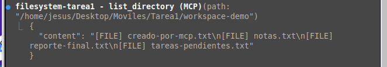
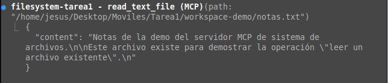
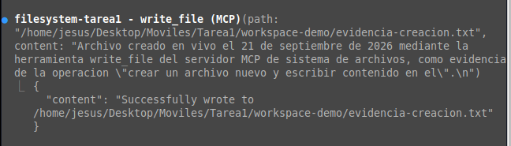
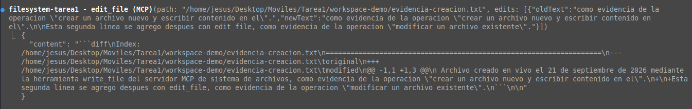
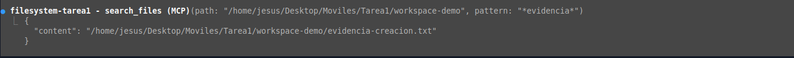
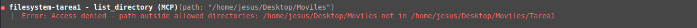

# Tarea 1 — MCP y sistema de archivos: investigación e implementación

## Portada

- **Nombre completo:** Jesús Ángel González Arellano
- **Número de boleta:** 2022630690
- **Grupo:** 7CV4
- **Asignatura:** Desarrollo de aplicaciones móviles nativas
- **Profesor(a):** Gabriel Hurtado Avilés
- **Fecha de entrega:** 21 de septiembre de 2026

---

## Resumen

Investigación sobre cómo un LLM, aislado por diseño (solo texto de entrada/salida), pasa a operar sobre archivos locales mediante el **Model Context Protocol (MCP)**, distinguiéndolo de una API tradicional. En la parte práctica se instaló y probó un **servidor MCP de sistema de archivos** delimitado a un directorio de trabajo propio, usando **Claude Code** como cliente/host, y (bonus) un **servidor MCP propio** con dos herramientas en Python.

### Índice de `docs/`

| Documento | Contenido |
|---|---|
| [01-evolucion-modelos.md](docs/01-evolucion-modelos.md) | De LM a LLM; razonamiento explícito y por qué no surge solo de la escala |
| [02-aislamiento.md](docs/02-aislamiento.md) | Por qué un LLM no puede ver ni modificar archivos por sí mismo |
| [03-mcp-vs-api.md](docs/03-mcp-vs-api.md) | **Punto central**: API vs. MCP, tabla comparativa, MCP no sustituye a las APIs |
| [04-arquitectura-mcp.md](docs/04-arquitectura-mcp.md) | Host/cliente/servidor, primitivas, transportes, versión de la especificación |
| [05-servidor-filesystem.md](docs/05-servidor-filesystem.md) | El servidor filesystem como servidor de referencia y su alcance por directorios |
| [06-seguridad.md](docs/06-seguridad.md) | Riesgos (prompt injection, path traversal, escritura no deseada) y mitigaciones |
| [07-casos-de-uso.md](docs/07-casos-de-uso.md) | Tres herramientas reales que implementan MCP |
| [exposicion-contexto.md](docs/exposicion-contexto.md) | Guion/contexto para preparar la exposición (no son las diapositivas) |

---

## MCP vs. API

| Dimensión | API tradicional | MCP |
|---|---|---|
| Quién decide qué se invoca | La persona desarrolladora, en el código, de antemano | El modelo, en tiempo de ejecución |
| Descubrimiento de capacidades | Documentación externa, leída antes de programar | Catálogo descubierto en tiempo de ejecución |
| Acoplamiento cliente–servicio | Alto (código atado a esa API) | Bajo (cualquier cliente MCP habla con cualquier servidor MCP) |
| Formato de mensajes | Varía (REST/JSON, XML, gRPC...) | Estandarizado: JSON-RPC 2.0 |
| Autenticación y consentimiento | Definida por cada proveedor | Contemplada en el protocolo (OAuth remoto, *elicitation*) |
| Reutilización entre apps | Baja | Alta |

**MCP no sustituye a las APIs**: un servidor MCP envuelve una API o recurso ya existente (aquí, el sistema de archivos) y lo hace descubrible e invocable por un modelo. Detalle completo en [docs/03-mcp-vs-api.md](docs/03-mcp-vs-api.md).

---

## Implementación

**Cliente elegido:** Claude Code — soporta MCP nativamente vía `.mcp.json`, sin instalar nada adicional, y permitió documentar y demostrar todo dentro de la misma sesión de trabajo.

**Sistema operativo / versiones:** Linux (Ubuntu, kernel 6.17), Node.js v24.18.0, Python 3.12.3.

### Instalación (reproducible)

1. Clonar el repositorio y ubicarse en su raíz.
2. Revisar `.mcp.json` (igual a `config/mcp.json`, sin credenciales):

   ```json
   {
     "mcpServers": {
       "filesystem-tarea1": {
         "command": "npx",
         "args": ["-y", "@modelcontextprotocol/server-filesystem", "/ruta/al/repo/workspace-demo"]
       },
       "servidor-propio": {
         "command": "/ruta/a/tu/venv/bin/python",
         "args": ["/ruta/al/repo/servidor-propio/server.py"]
       }
     }
   }
   ```

   Ajustar las rutas absolutas a donde se clonó el repositorio.
3. Abrir Claude Code en la raíz del proyecto y aprobar los servidores MCP que detecte (`filesystem-tarea1`, `servidor-propio`).
4. Verificar con `/mcp` que ambos aparecen con sus herramientas (`list_directory`, `read_text_file`, `write_file`, `edit_file`, `search_files`, `contar_texto`, `convertir_temperatura`, etc.).
5. (Bonus) `cd servidor-propio && python3 -m venv .venv && source .venv/bin/activate && pip install -r requirements.txt`.

---

## Evidencias

Operaciones ejecutadas realmente (no simuladas) dentro de Claude Code sobre `workspace-demo/`:

**Listar el directorio autorizado**



**Leer un archivo existente**



**Crear un archivo nuevo**



**Modificar un archivo existente**



**Buscar un archivo por nombre/contenido**



### Prueba del límite de seguridad

Se pidió listar `/home/jesus/Desktop/Moviles` (fuera del proyecto). El servidor rechazó la operación:

```
Access denied - path outside allowed directories: /home/jesus/Desktop/Moviles not in /home/jesus/Desktop/Moviles/Tarea1
```



**Nota técnica:** el directorio realmente autorizado resultó ser todo el proyecto (`Tarea1`), no solo `workspace-demo/` como se configuró por argumento. Claude Code, como cliente MCP, comparte con el servidor la raíz del proyecto vía el protocolo de **Roots**, y esa notificación *reemplaza* el directorio pasado por argumento al arrancar el servidor. Se comprobó en vivo: leer `README.md` (fuera de `workspace-demo/` pero dentro de `Tarea1`) funcionó; listar fuera de `Tarea1` fue rechazado. El alcance sigue siendo una carpeta específica de la tarea, nunca la raíz del disco ni el home completo. Detalle en [docs/05-servidor-filesystem.md](docs/05-servidor-filesystem.md).

---

## Conclusiones personales

[Completar con tus propias palabras: qué aprendiste de MCP vs. APIs, qué te sorprendió del hallazgo de Roots y del límite de seguridad, y cómo cambia esto la forma de desarrollar software.]

---

## Referencias (APA)

Model Context Protocol. (2026). *Specification* (Versión 2026-07-28, la consultada para esta tarea). https://modelcontextprotocol.io/specification/2026-07-28/

Model Context Protocol. (s.f.). *Versioning*. https://modelcontextprotocol.io/specification/versioning

Model Context Protocol. (s.f.). *Architecture*. https://modelcontextprotocol.io/specification/2026-07-28/architecture

Model Context Protocol. (s.f.). *Transports*. https://modelcontextprotocol.io/specification/2026-07-28/basic/transports

Model Context Protocol. (s.f.). *Roots*. https://modelcontextprotocol.io/specification/2026-07-28/client/roots

Model Context Protocol. (s.f.). *Elicitation*. https://modelcontextprotocol.io/specification/2026-07-28/client/elicitation

Modelcontextprotocol/servers. (s.f.). *Filesystem MCP Server* [Repositorio de código]. GitHub. https://github.com/modelcontextprotocol/servers/tree/main/src/filesystem

Google Developers Blog. (s.f.). *Build with Google Antigravity, our new agentic development platform*. https://developers.googleblog.com/build-with-google-antigravity-our-new-agentic-development-platform/

Cursor. (s.f.). *Model Context Protocol*. https://cursor.com/docs/context/mcp

Vaswani, A., Shazeer, N., Parmar, N., Uszkoreit, J., Jones, L., Gomez, A. N., Kaiser, Ł., & Polosukhin, I. (2017). *Attention is all you need*. Advances in Neural Information Processing Systems, 30.

---

## Estructura del repositorio

```text
README.md          Este documento
docs/               Investigación, en archivos .md
config/             Configuración MCP utilizada (sin credenciales)
img/                Capturas de pantalla de la demo
servidor-propio/    Servidor MCP propio (bonus)
workspace-demo/     Directorio de trabajo delimitado usado por el servidor filesystem
```
